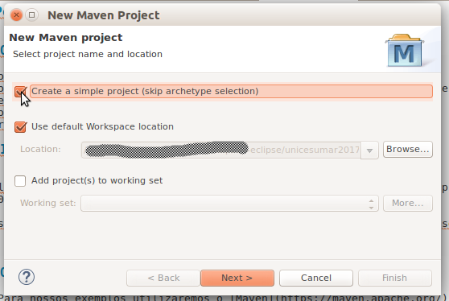
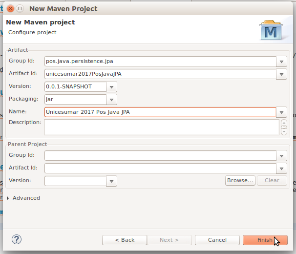
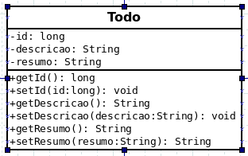

# Persistência com JPA


## Introdução

A última especificação da API JPA é a [JSR 388 Java Persistence 2.1](https://www.jcp.org/en/jsr/detail?id=338), liberada en 22/05/2013  recomendo a leitura.

Existem várias implementações da API JPA, iremos usar a Eclipselink por ser a **implementação de referência**.

**Objetivos**

* Conhecer a API JPA;
* Conectar-se a um banco de dados utilizando a implementação JPA [EclipseLink](https://www.eclipse.org/eclipselink/);
* Realizar Mapeamento Objeto Relaciona;
* Compreender os conceitos necessários para utilizar a API;
* Praticar com exemplos;

## O projeto

 - Para nossos exemplos utilizaremos o [Maven](https://maven.apache.org/) para resolver as dependências.
 - Utilizaremos a IDE [eclipse](http://www.eclipse.org/) ou o [STS - Spring Tool Suite](https://spring.io/tools/sts)
 - Utilizaremos o Plugin Dali que já vem no eclipse WTP e no STS.

### Crie um projeto Maven

Clique em **File/New/Maven Project** será mostrada a tela de configuração de novo projeto maven, marque a opção _skip artefact creation_ para simplificar o processo, isso nos permitirá criar um projeto maven com um archetype java simples.



Pressione **Next**, a tela de configuração do projeto será mostrada, preencha conforme a imagem, isso facilitará a correção em sala, e deixará organizado em seus exemplos.



Após preenchidos os devidos campos, pressione **Finish** e seu projeto será criado.

### Adicionando as dependências

Abra o arquivo pom.xm para adicionarmos as dependências do eclipselink, mysql, e postgresql.


#### Adicionando dependencias pela interface

Clique na aba **Dependencies** localizada no canto inferior esquerdo do arquivo pom, procure o botão *add*, na tela de seleção de dependências, você pode informar os dados da dependência, ou pesquisar por exemplo **eclipselink** no índice ( o indice do maven precisa estar atualizado ), que mostrará as diversas versões disponíveis no índice. ao término pressione OK.

### Adicionando diretamento no XML

Apesar de o eclipse dispor de uma iterface que facilita o trabalho com o maven, podemos também editar o arquivo xml, para isso clique na aba **pom.xml**, localizada no canto inferior direito do arquivo pom, e inclua as dependências na sessão dependencies, que pode ou não existir no arquivo


```xml
	<dependencies>
		<dependency>
			<groupId>org.eclipse.persistence</groupId>
			<artifactId>eclipselink</artifactId>
			<version>2.6.4</version>
		</dependency>
		<dependency>
			<groupId>mysql</groupId>
			<artifactId>mysql-connector-java</artifactId>
			<version>5.1.42</version>
		</dependency>
		<dependency>
			<groupId>org.postgresql</groupId>
			<artifactId>postgresql</artifactId>
			<version>42.1.1</version>
		</dependency>
	</dependencies>
```
## Conhecendo o JPA

O modelo do JPA é simples, elegante poderoso e flexível, e ainda é fácil de compreender.


### Persistência de POJO

Um dos aspectos mais importantes é o fato de que os objetos são POJO, ou seja não tem nada de especial. portanto qualquer objeto não final existente na aplicação com um construtor padrão pode ser persistido sem muitas mudanças.

O mapeamento objeto relacional com o JPA acontece inteiramente com o uso de metadados. E isso pode ser feito adicionando _annotations_ ao código, ou usando um arquivo xml externo.

JPA foi criada para ser não Intrusiva, os objetos persistidos nem precisam saber da existência da mesma _(xml configurations)_.


### JPQL

A API permite que realizemos consultas entre as entidades e seus relacionamentos sem precisar usar chaves primárias ou colunas do banco. As consultas podem ser expressas em JPQL, uma linguagem de busca que é baseada no modelo do objeto utilizado para o mapeamento, não sendo necessário nem mesmo conhecer as colunas do banco de dados, a JPQL será apropriadamente traduzida para o sql do banco em uso.

A query pode ser definida de forma estática, em metadados, ou dinâmicamente, passando os critérios quando na construção. As queries retornam objetos na forma entidades, projeções de atributos específicos, ou mesmo funções com valores agregados. as consultas do JPA permitem pesquisar entre objetos java ao invés de tabelas concretas de banco de dados.

### Entity

Entidades _Entities_ no JPA são classes que serão persistidas em algum mecanismo de armazenamento.

### Identity

Toda classe java possui uma identidade, porem quando esses dados existem em um banco de dados, eles também possuem uma identidade de pesisitência. A identidade de um objeto java o distingue de outros objetos que ocupam a memória, A identidade de persistência ou Identificador, é a chave que identifica o registro em um banco de dados, podendo ser uma coluna no banco de dados.

### Transacionalidade

Como as entidades serão persistidas em um banco de dados,  elas são criadas, atualizadas e removidas  em um contexto de transação, ou seja as mudanças aplicadas ao banco irção falhar ou ter sucesso forma atômica,

Em memória, já a história é outra, as mudanças podem ocorrer sem ao mesmo ser persistidas.

### Metadados

Toda entidade JPA possui alguns métadados associados que a descrevem, estes metadados podem existir junto com a classe através do uso de annotations, ou externamente com o uso de XML. porem eles não são persistidos no banco.

Os metadados necessários para uma entidade são mínimos, porem como toda tecnologia sofisticada, existem muitos tipos de metadados, para alcançar diferentes objetivos.

## Modelando nosso projeto

Como exemplo criaremos uma lista de tarefas bem simples, que iremos adicionando complexidade.

O Modelo inicial é mostrado abaixo:

 


Crie a classe Todo Conforme o modelo acima.

## Configurando persistência no projeto *persisntence.xml*

Para utilizar a API em nosso projeto, precisaremos configurar um arquivo xml onde serão descritos os metadados da nossa conexão e as classes transformadas em Entidades.

Para isso vamos criar uma pasta chamada **META-INF** dentro da pasta *src/main/resources*, com a pasta META-INF criada, crie o arquivo **persistence.xml**, dentro da pasta META-INF.

Adicione o conteúdo abaixo no arquivo.

```xml
<?xml version="1.0" encoding="UTF-8"?>
<persistence version="2.1"
             xmlns="http://xmlns.jcp.org/xml/ns/persistence"
             xmlns:xsi="http://www.w3.org/2001/XMLSchema-instance"
             xsi:schemaLocation="http://xmlns.jcp.org/xml/ns/persistence http://xmlns.jcp.org/xml/ns/persistence/persistence_2_1.xsd">
  <persistence-unit name="todo" transaction-type="RESOURCE_LOCAL">
    <provider>org.eclipse.persistence.jpa.PersistenceProvider</provider>
    <!-- classes -->
    <!-- properties -->
  </persistence-unit>
</persistence>
```

Observe que no arquivo estamos configurando para utilizar a JPA 2.1, e nosso **persistence unit** chamamos de **todo**, como estamos fazendo um projeto JavaSE, precisamos marcar o **tipo de transação** para *RESOURCE_LOCAL*.

Já com tudo isso configurado, precisamos agora adicionar as propriedades da nossa conexão:


```xml
    ...
    <properties>
      <property name="javax.persistence.jdbc.driver"   value="com.mysql.jdbc.Driver"/>
      <property name="javax.persistence.jdbc.url"      value="jdbc:mysql://localhost:3306/posjava?zeroDateTimeBehavior=convertToNull"/>
      <property name="javax.persistence.jdbc.password" value="morgado"/>
      <property name="javax.persistence.jdbc.user"     value="root"/>
      <property name="eclipselink.logging.level"       value="FINE"/>
      <property name="eclipselink.ddl-generation"      value="drop-and-create-tables"/>
    </properties>
    ...
```
Para cada banco de dados que formos utilizar, teremos diferentes configurações para jdbc driver, consulte o fornecedor do driver que for utilizar, da mesma forma, a url sofre alterações.

Observe que o eclipselink permite que configuremos log o que é muito útil em um cenário de solução de prolemas, para mais informações sobre log consulte em [EclipseLink JPA Logging](https://wiki.eclipse.org/EclipseLink/Examples/JPA/Logging)

Podemos realizar estas configurações utilizando a IDE.

> TODO Adicionar aqui o procedimento que mostrei na sala de aula, adicionando pela ide com o plugi Dali.

- Configurar uma conexão;
- Adicionar o Facet de JPA ao projeto;
- Adicionando propriedades através da interface; 

### Criando uma entidade

Com nossa unidade de persistência configurada podemos agora criar entidades, então vamos transformar nossa classe Todo em uma entidade. para isso iremos adicionar a annotation **@Entity**, e vamos definir também um identificador através da annotation **@Id**.

> As annotations podem ser colocadas nas classes, nos _fields_ **ou** nos métodos _getters_!

#### Adicionado adicionando a Entidade ao persistence Unit

Para que o JPA tome conhecimendo da nossa entidade, precisamos dizer quais classes fazem parte da unidade de persistencia que criamos, para isso adicione o código abaixo ao persistence.xml

```xml
<class>posjava.persistence.entities.Todo</class>
```

Com esta pequena configuração, estamos prontos para persistir nossa Entity.

Isso leva a uma questão, em que local no meu banco esta tabela será persistida?

Em que colunas da tabela os campos da classe serão persistidos?

## Entity Manager

Para o funcionamento da API, precisamos de algum mecanismo que controle as operações na entidade, no JPA esta tarefa é delegada a um objeto chamado convenientemente de **EntityManager**.


Obtendo um _EntityManager_, o _EntityManager_ é sempre obtido através de um _EntityManagerFactory_, o _EntityMangerFactory_ possui todas as informaçẽos que governam suas operações, que são obtidas a partir de um persistence Unit, onde temos definidos entre outras as informações de conexão com o banco.

```java
EntityManagerFactory emf = Persistence.createEntityManagerFactory( "persistence_unit");
EntityManager em = emf.createEntityManager();
```

A partir daqui, é interessante utilizar o maven para compilar o projeto e colocar o persistence.xml no CLASSPATH

## Operações básicas

### Persistindo uma entidade

Persistir uma entidade é a operação de pegar uma Entidade _transiente_, ou uma que não tem nenhuma representação no banco de dados, e armazenar seu estado para que possa ser recuperado mais tarde, e usaremos um EntityManager para persistir este estado, veja o exemplo;

```java
Todo todo = new Todo()
todo.setDescricao( "Estudar JPA" );
todo.setResumo( "Comprender os conceitos envolvidos na persistencia de dados com JAVA" );
em.persist( todo );
```

### Buscando uma entidade

Uma vez que a entidade está persistida, o próximo passo é recupera-la, veja o exemplo:

```java
Todo todo = em.find( Todo.class, 1 );
```

Aqui estamos passando ao método find, a entidade que buscamos e o identificador. Ao retornar a entidade dizemos que ela esta gerênciada, que significa que ela existe em um contexto de persistência associado com o EntityManager, verifique também que o objeto retornado já e do tipo desejado o que elimina a necessidade de fazer *cast*.

Mas o que acontece se o objeto tiver sido deletado ou simplesmente não existir?
Neste caso, o método find irá retornar **null**, portando será necessário fazer a checagem antes de usar a variável.

### Removendo uma entidade

Remover uma Entidade não é tão simples, muitas aplicações nunca realmente deletam uma entidade, eles apenas marcam como removida, mas estamos falando de algo que gere uma expressão de *DELETE* no banco.

Para remover uma Entidade, a Entidade precisa primeiro ser _gerênciada_, ou seja deve estar presente no contexto de persistência. Ou seja teremos que buscar a entidade para aplicar um comando de remoção. Isso não chega a ser um problema, uma vez que sempre conferimos o que apagamos (ou não).

```java
Todo todo = em.find( Todo.class, 1 );
em.remove( todo );
```

### Atualizando uma entidade

Existe diversas formas de atualizar uma entidade, vamos ver o caso mais simples e comum, Obtemos uma entidade gerenciada, aplicamos as alterações, conforme exemplo:

```java
Todo todo = em.find( Todo.class, 1 );
todo.setNome("JPA é bacana");
```
